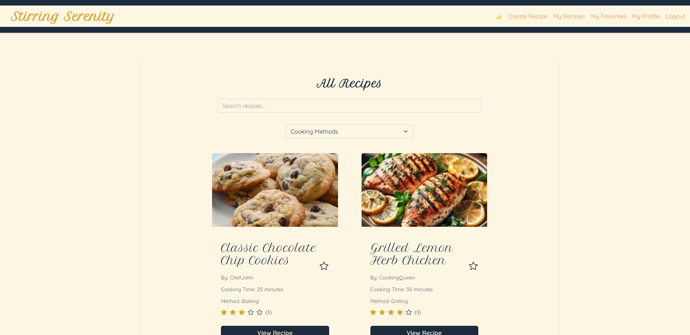
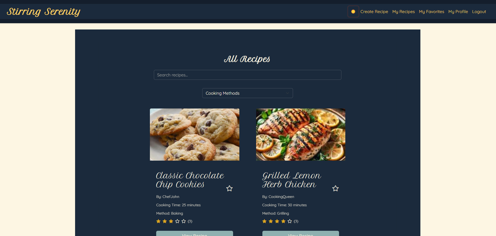
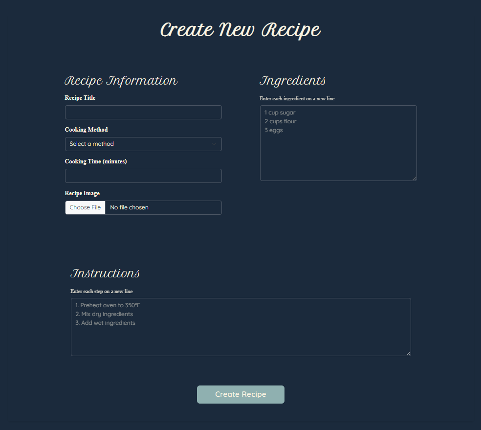
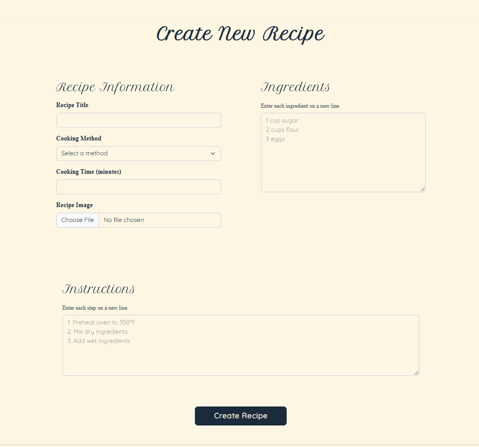
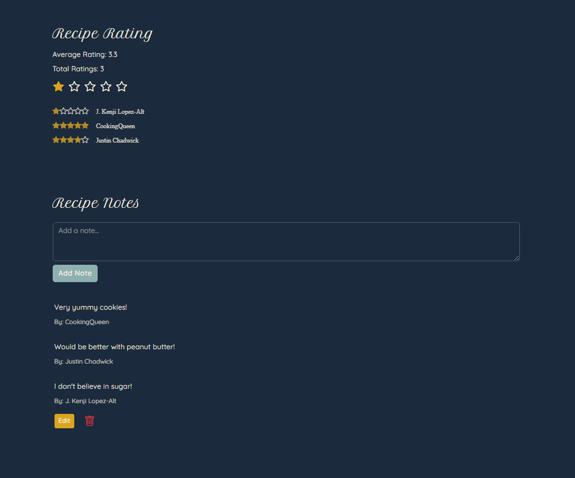
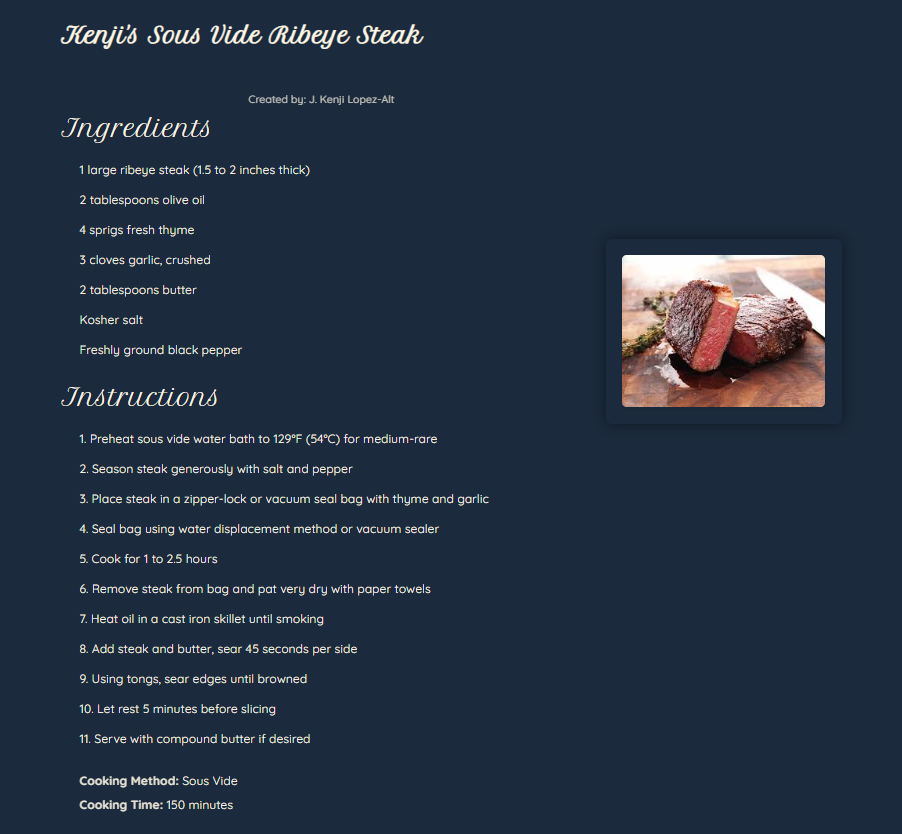

Stirring Serenity

Stirring Serenity is a social recipe sharing platform designed to help friends share and discover each other's recipes. Create your own digital cookbook, explore recipes from friends, and build a community around cooking and sharing meals.
Features

Recipe Sharing & Discovery

Share your favorite recipes with friends
Discover what your friends are cooking
Get inspired by similar recipe suggestions

Social Features

Rate and review friends' recipes
Add personal notes to remember modifications
Save favorites to your digital cookbook

User Profiles

Track your favorite recipes
See your friends' recipes and notes
Manage your recipe collection

Recipe Management

Easy recipe creation and editing
Image upload support
Ingredient and instruction management

Personalization

Light and dark theme options
Personal notes on recipes
Favorite recipe collection

Screenshots
Login page

Home Page

Users can see a list of all the recipes and search by typing letters or words in a search bar or by a cooking method dropdown

Recipe Creation

Users can create a new recipe with a picture

Social Features

Recipe Details

Personal Recipes

Favorite Recipes

Technologies Used

React 18
Vite
React Router DOM
Bootstrap 5
Cloudinary (for recipe image uploads)
ESLint (for code quality)

Prerequisites

Before you begin, ensure you have the following installed:

Node.js (latest LTS version recommended)
npm or yarn

Installation

Clone the repository:

bashCopy
git clone <your-repository-url>
cd stirring-serenity

Install dependencies:

bashCopy
npm install

Cloudinary Setup:

For Viewing Recipes:

No setup needed! You can view all recipes and their images immediately

For Creating/Editing Recipes with Images:

Create a free account at Cloudinary
In your Cloudinary dashboard:

Get your Cloud Name
Create an upload preset:

Go to Settings > Upload
Scroll to Upload presets
Create a new upload preset
Set the signing mode to "unsigned"

Create a .env file in the root directory with the following variables:
CopyVITE_CLOUDINARY_CLOUD_NAME=your_cloud_name
VITE_CLOUDINARY_UPLOAD_PRESET=your_upload_preset

Start the development server:

bashCopy
npm run dev

Image Handling

All recipe images are publicly viewable to anyone using the application
Cloudinary credentials are only required for uploading new images when creating or editing recipes
Existing recipe images will display regardless of whether you have Cloudinary configured
Image URLs are stored in the database and are accessible to all users

Project Structure
Copy/
├── src/
│ ├── api/ # Database configuration
│ ├── components/ # React components by feature
│ ├── services/ # API service functions
│ ├── hooks/ # Custom React hooks
│ ├── utils/ # Utility functions
│ └── theme/ # Theme customization
├── .env # Environment variables
├── .gitignore # Git ignore rules
├── setup.sh # Setup script
├── vite.config.js # Vite configuration
└── package.json # Project dependencies

Connect With Me

Website: [Your website]
Email: [Your email]
LinkedIn: [Your LinkedIn]
GitHub: [Your GitHub]

Future goals

digital cookbook instead of favorites page
